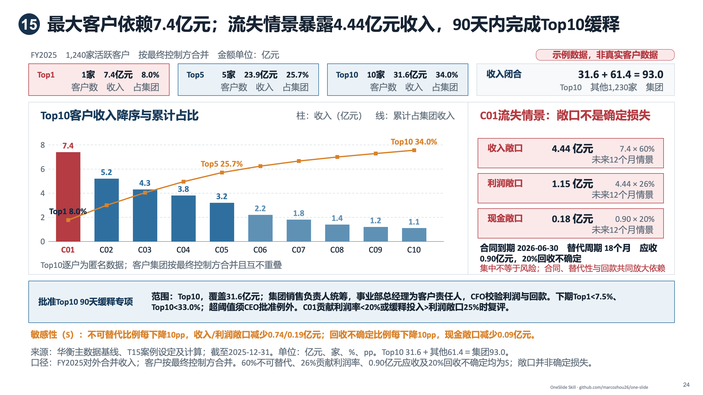
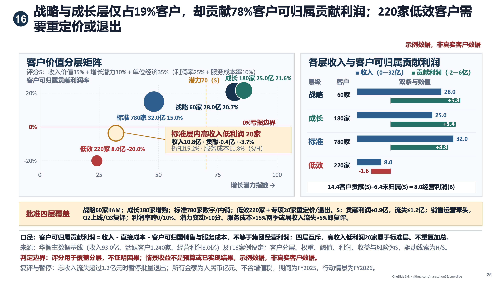
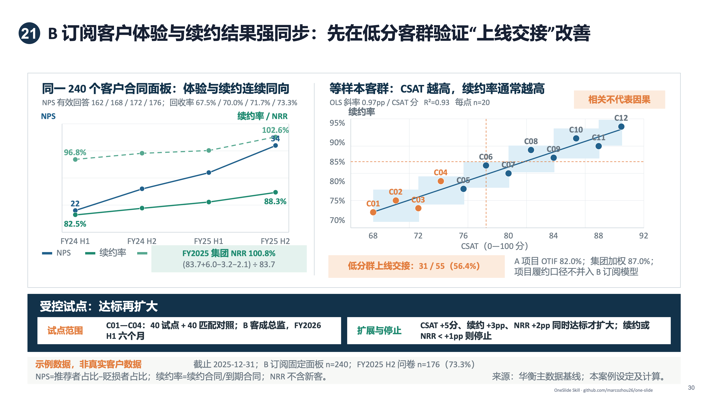
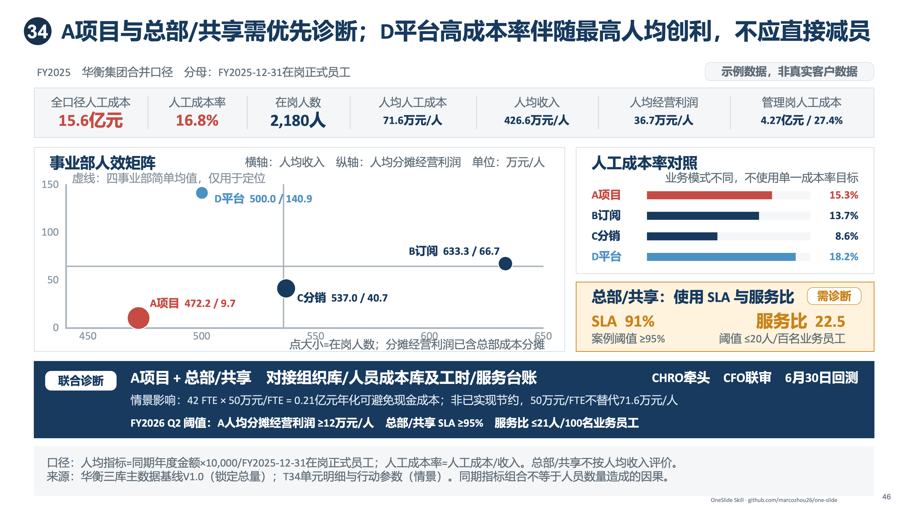
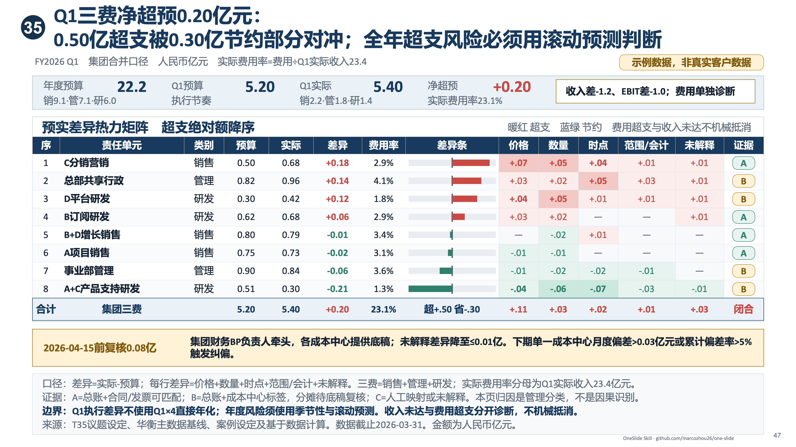
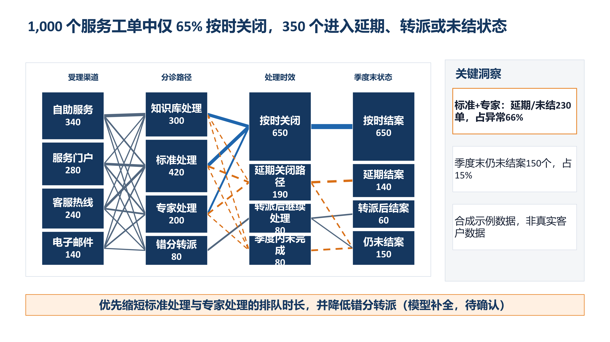
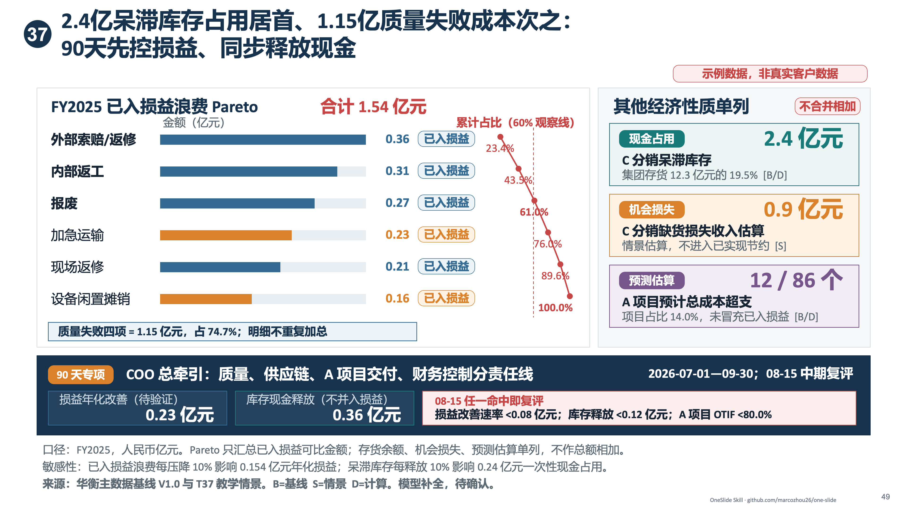
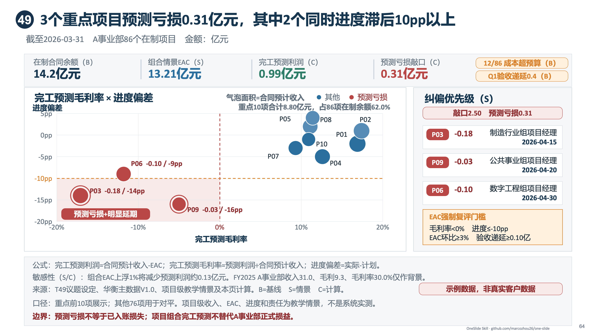

# OneSlide

Turn complete or scattered source material into one clear, source-traceable, natively editable PowerPoint slide.

OneSlide is for people who want a professional single-slide presentation without writing a complex prompt. Start with one sentence or provide complete source material. When essential information is missing, OneSlide adds only the minimum needed content, preserves the supplied meaning, and clearly labels model-generated content, calculations, and externally verified sources.

[Download OneSlide v1.5.0](../../releases/download/v1.5.0/one-slide-v1.5.0.zip) · [Get started](#get-started-in-three-minutes) · [中文提示词指南](https://github.com/marcozhou26/oneask/blob/main/docs/OneSlide_%E6%8F%90%E7%A4%BA%E8%AF%8D%E8%BE%93%E5%85%A5%E6%8C%87%E5%8D%97_%E5%85%AC%E5%BC%80%E7%89%88_v1.0.md) · [Report an issue](../../issues)

## Turn management questions into decision-ready slides

These examples show how OneSlide combines a management question, supporting evidence, and a concrete action on one editable slide. Seven pages come from a synthetic business-analysis case library; the Sankey page demonstrates end-to-end flow analysis. All displayed data is simulated or synthetic and contains no real customer, employee, or personal information.

<table>
  <tr>
    <td width="50%"><br><b>Customer concentration risk:</b> Top-account dependency, revenue-loss exposure, and 90-day retention actions</td>
    <td width="50%"><br><b>Customer profitability:</b> Contribution profit, service load, and treatment by customer tier</td>
  </tr>
  <tr>
    <td width="50%"><br><b>Renewal driver analysis:</b> Link customer-experience scores to renewal outcomes and prioritize validation</td>
    <td width="50%"><br><b>Project portfolio:</b> Compare return, risk, and delivery readiness to reset investment priority</td>
  </tr>
  <tr>
    <td width="50%"><br><b>Budget variance control:</b> Separate overspend, timing differences, and avoidable variance</td>
    <td width="50%"><br><b>Flow analysis:</b> Candidate sourcing, screening, hiring, and retention</td>
  </tr>
  <tr>
    <td width="50%"><br><b>Inventory risk:</b> Cash tied up, aging structure, recurring failures, and disposal actions</td>
    <td width="50%"><br><b>Project forecast risk:</b> Forecast losses, schedule delays, risk clusters, and escalation priorities</td>
  </tr>
</table>

## One slide means one slide

Each run produces exactly one 16:9 slide. If the source material cannot fit honestly on one slide, OneSlide recommends the strongest single-slide focus or asks you to choose. It does not silently turn the request into a multi-slide deck.

Two output modes are available:

- `PROMPT_ONLY`: produces a complete prompt and handoff package for another presentation tool or model.
- `PPT_DRAFT`: produces a natively editable PowerPoint slide and runs basic layout checks.

If you do not explicitly request a PowerPoint file, OneSlide defaults to `PROMPT_ONLY`.

## Get started in three minutes

1. Download and unzip [OneSlide v1.5.0](../../releases/download/v1.5.0/one-slide-v1.5.0.zip).
2. Copy the top-level `one-slide` folder into the Skills directory of a compatible agent client.
3. Refresh the client and invoke `$one-slide`.

Prompt package only:

```text
Create one slide explaining that frontline managers spend too much time on approvals and meetings. Add reasonable illustrative data where needed, and return only the prompt package.
```

Editable PowerPoint draft:

```text
Create one professional, editable PowerPoint slide from this material. You may fill essential gaps, but clearly label anything you add.
```

## How OneSlide handles missing information

Every important content item is classified as one of the following:

- supplied by the user;
- a stable inference from the supplied material;
- calculated from supplied data;
- model-generated and pending confirmation; or
- verified from an external source.

When synthetic data is used, the slide must display: “Synthetic sample data, not real customer data.” Confirming an illustrative scenario does not turn it into a verified fact.

## Runtime requirements

- `PROMPT_ONLY`: Python 3.10 or later.
- `PPT_DRAFT`: Node.js and a Codex environment compatible with `@oai/artifact-tool`.
- Full PowerPoint verification requires Microsoft PowerPoint. If it is unavailable, the result must state `POWERPOINT_OPEN_CHECK=not_tested`.

Check the environment:

```bash
python3 scripts/check_environment.py
```

Validate the Skill package:

```bash
python3 scripts/validate_suite.py .
python3 -m unittest discover -s tests -v
```

## Repository structure

- `SKILL.md`: the single user-facing entry point.
- `producer/`: interprets source material, fills targeted gaps, and records provenance.
- `builder/`: selects the visual structure, creates native PowerPoint objects, and checks layout.
- `editorial/`: reviews the rendered draft, protects strong pages, and returns at most one high-value repair brief to Builder without editing the PowerPoint itself.
- `showcase/`: public single-slide previews using simulated or synthetic data.
- `scripts/` and `tests/`: environment checks, package validation, and regression tests.

## Current boundaries

- OneSlide creates one slide at a time; it does not design the storyline for a full presentation.
- Added content never overrides user-supplied facts, and simulated content must not be presented as real data.
- If PowerPoint-generation dependencies are unavailable, OneSlide delivers only the prompt and structured handoff package.
- Do not submit customer data, employee personal information, or other sensitive material through public issues.

## Author

- Author and maintainer: 周俊东 Marco
- WeChat public account and Channels account: 周俊东Marco
- WeChat: `zhou139223` (include “OneSlide” in the invitation note)

## Licensing

- `SKILL.md`, execution engines, scripts, configuration, and test code: Apache License 2.0.
- Original instructions, tutorials, sample inputs, sample outputs, and original reference presentations: CC BY 4.0.
- The names “OneSlide” and “周俊东 Marco,” profile images, logos, and WeChat account branding are not included in the open licenses. Reasonable attribution that identifies the source of the work is permitted.
- See `LICENSE_STATUS.md`, `CONTENT-LICENSE.md`, `TRADEMARKS.md`, and `NOTICE` for the exact scope.

Slides created through ordinary use of OneSlide do not need an author watermark or signature. Redistribution or modification of OneSlide itself, its documentation, or its examples remains subject to the applicable license.

## Version status

The latest public release is v1.3.0. The next version is testing an internal read-only Editorial QA gate after the Builder draft: it protects strong pages, returns at most one high-value revision brief, and leaves all PPTX changes to Builder. This development work is not released yet. The 32 productized visual modules include native pie and single-ring doughnut support through `part-to-whole`, plus a variable HR operating diagnostic matrix. Five common consulting layouts are preserved as direct-composition patterns instead of fixed modules, and map generation is retired. Font and layout differences may still occur across clients and PowerPoint versions.
