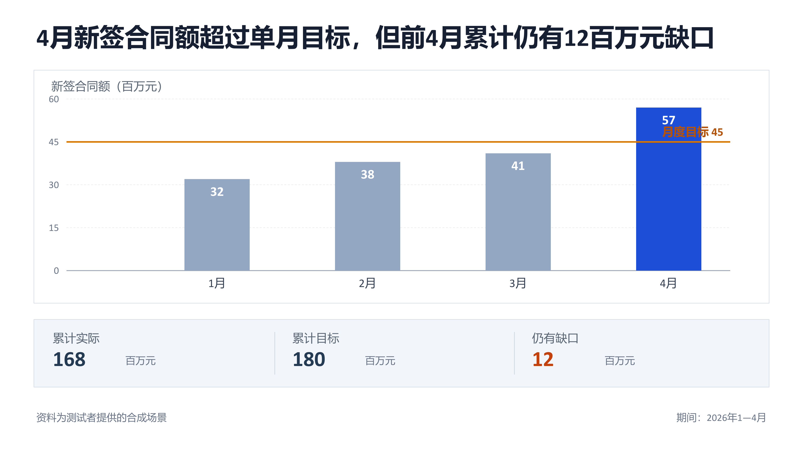
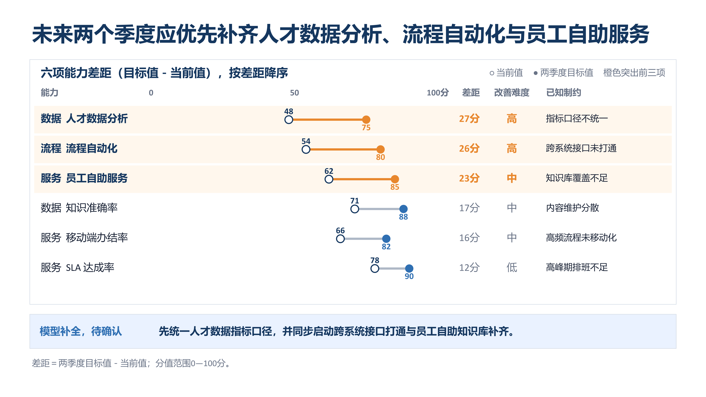
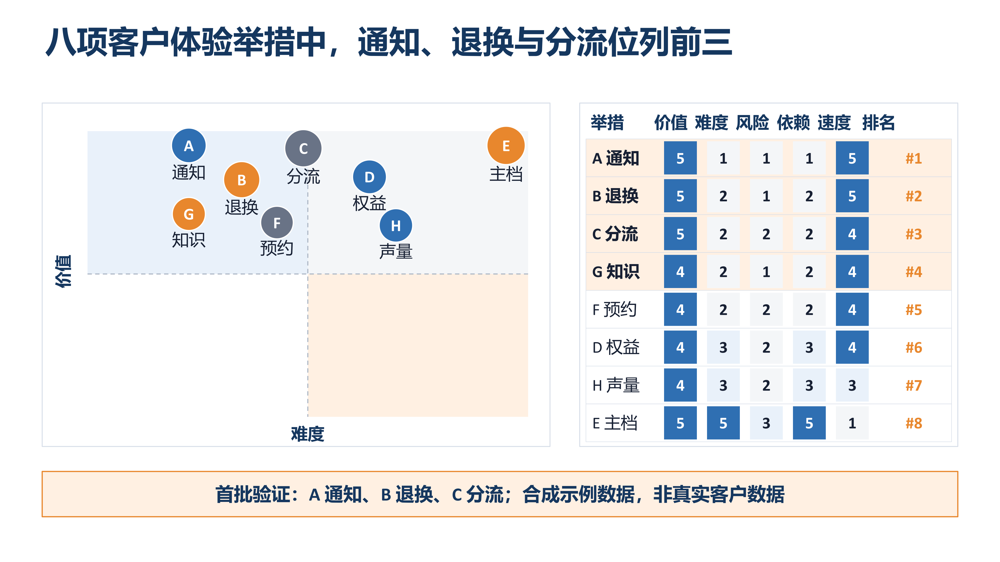
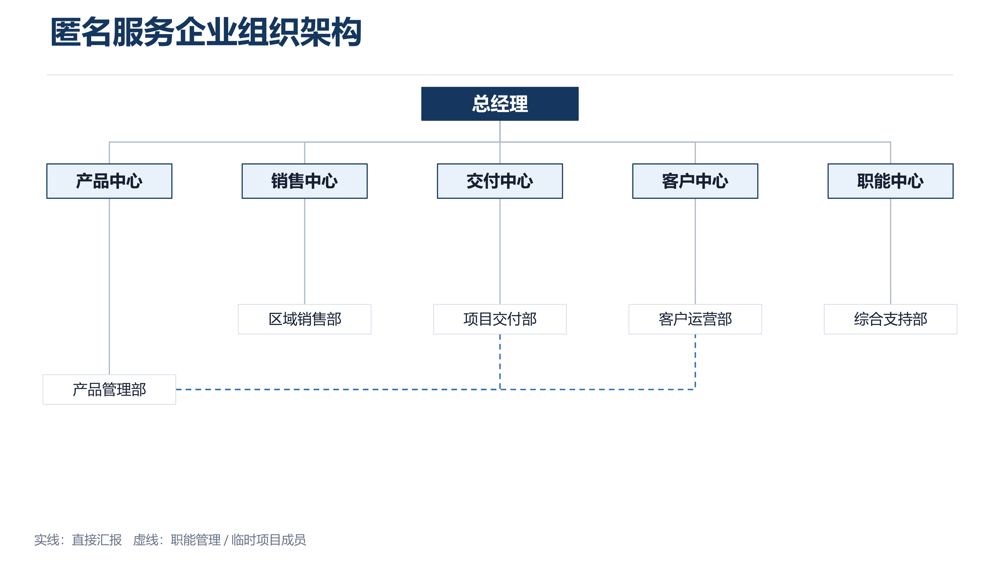
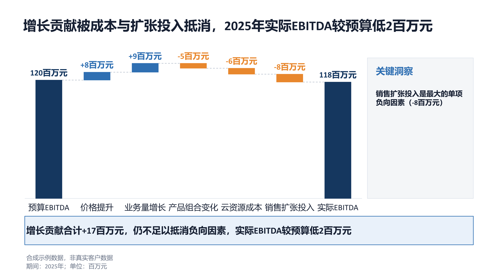
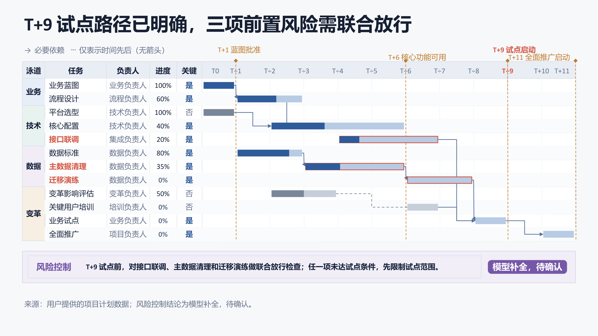
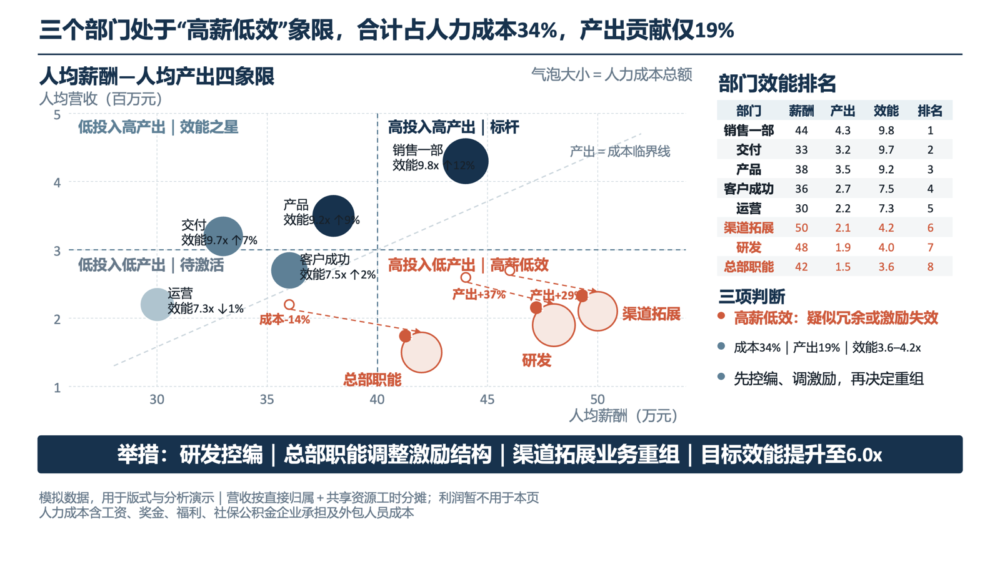

# OneSlide

Turn complete or scattered source material into one clear, source-traceable, natively editable PowerPoint slide.

OneSlide is for people who want a professional single-slide presentation without writing a complex prompt. Start with one sentence or provide complete source material. When essential information is missing, OneSlide adds only the minimum needed content, preserves the supplied meaning, and clearly labels model-generated content, calculations, and externally verified sources.

[Download OneSlide v1.4.0](../../releases/latest/download/one-slide-v1.4.0.zip) · [Get started](#get-started-in-three-minutes) · [Report an issue](../../issues)

## Explain complex logic on one slide

The examples below show slide types supported or migrated into OneSlide. All displayed data is simulated or synthetic and contains no real customer, employee, or personal information.

<table>
  <tr>
    <td width="50%"><br><b>Bar chart:</b> Actual, target, and cumulative shortfall</td>
    <td width="50%"><br><b>Capability analysis:</b> Gaps, difficulty, and constraints</td>
  </tr>
  <tr>
    <td width="50%"><br><b>Bubble matrix:</b> Value, difficulty, and priority</td>
    <td width="50%"><br><b>Organization chart:</b> Solid-line reporting and dotted-line collaboration</td>
  </tr>
  <tr>
    <td width="50%"><br><b>Waterfall:</b> Budget-to-actual variance attribution</td>
    <td width="50%"><br><b>Flow analysis:</b> Candidate sourcing, screening, hiring, and retention</td>
  </tr>
  <tr>
    <td width="50%"><br><b>Project Gantt:</b> Progress, dependencies, and release conditions</td>
    <td width="50%"><br><b>Pay effectiveness:</b> Pay per employee, output per employee, and department quadrants</td>
  </tr>
</table>

## One slide means one slide

Each run produces exactly one 16:9 slide. If the source material cannot fit honestly on one slide, OneSlide recommends the strongest single-slide focus or asks you to choose. It does not silently turn the request into a multi-slide deck.

Two output modes are available:

- `PROMPT_ONLY`: produces a complete prompt and handoff package for another presentation tool or model.
- `PPT_DRAFT`: produces a natively editable PowerPoint slide and runs basic layout checks.

If you do not explicitly request a PowerPoint file, OneSlide defaults to `PROMPT_ONLY`.

## Get started in three minutes

1. Download and unzip [one-slide-v1.4.0.zip](../../releases/latest/download/one-slide-v1.4.0.zip).
2. Copy the top-level `one-slide` folder into the Skills directory of a compatible agent client.
3. Refresh the client and invoke `$one-slide`.

Prompt package only:

```text
Create one slide explaining that frontline managers spend too much time on approvals and meetings. Add reasonable illustrative data where needed, and return only the prompt package.
```

Editable PowerPoint draft:

```text
Create one professional, editable PowerPoint slide from this material. You may fill essential gaps, but clearly label anything you add.
```

## How OneSlide handles missing information

Every important content item is classified as one of the following:

- supplied by the user;
- a stable inference from the supplied material;
- calculated from supplied data;
- model-generated and pending confirmation; or
- verified from an external source.

When synthetic data is used, the slide must display: “Synthetic sample data, not real customer data.” Confirming an illustrative scenario does not turn it into a verified fact.

## Runtime requirements

- `PROMPT_ONLY`: Python 3.10 or later.
- `PPT_DRAFT`: Node.js and a Codex environment compatible with `@oai/artifact-tool`.
- Full PowerPoint verification requires Microsoft PowerPoint. If it is unavailable, the result must state `POWERPOINT_OPEN_CHECK=not_tested`.

Check the environment:

```bash
python3 scripts/check_environment.py
```

Validate the Skill package:

```bash
python3 scripts/validate_suite.py .
python3 -m unittest discover -s tests -v
```

## Repository structure

- `SKILL.md`: the single user-facing entry point.
- `producer/`: interprets source material, fills targeted gaps, and records provenance.
- `builder/`: selects the visual structure, creates native PowerPoint objects, and checks layout.
- `editorial/`: reviews the actual rendered draft, applies one conservative native-object edit when it clearly improves comprehension, and rolls back unsafe candidates.
- `showcase/`: public single-slide previews using simulated or synthetic data.
- `scripts/` and `tests/`: environment checks, package validation, and regression tests.

## Current boundaries

- OneSlide creates one slide at a time; it does not design the storyline for a full presentation.
- Added content never overrides user-supplied facts, and simulated content must not be presented as real data.
- If PowerPoint-generation dependencies are unavailable, OneSlide delivers only the prompt and structured handoff package.
- Do not submit customer data, employee personal information, or other sensitive material through public issues.

## Author

- Author and maintainer: 周俊东 Marco
- WeChat public account and Channels account: 周俊东Marco
- WeChat: `zhou139223` (include “OneSlide” in the invitation note)

## Licensing

- `SKILL.md`, execution engines, scripts, configuration, and test code: Apache License 2.0.
- Original instructions, tutorials, sample inputs, sample outputs, and original reference presentations: CC BY 4.0.
- The names “OneSlide” and “周俊东 Marco,” profile images, logos, and WeChat account branding are not included in the open licenses. Reasonable attribution that identifies the source of the work is permitted.
- See `LICENSE_STATUS.md`, `CONTENT-LICENSE.md`, `TRADEMARKS.md`, and `NOTICE` for the exact scope.

Slides created through ordinary use of OneSlide do not need an author watermark or signature. Redistribution or modification of OneSlide itself, its documentation, or its examples remains subject to the applicable license.

## Version status

The current release is v1.4.0. OneSlide now adds an internal Editorial Editor after the Builder draft: it inspects the real PPTX and full-slide render, diagnoses one material comprehension problem, applies a tightly constrained native-object edit, reruns fidelity, layout, contrast, and PowerPoint checks, and rolls back candidates that do not improve the page safely. This release also blocks decorative top bands, title eyebrows, heading accents, empty strips, and other visible elements that do not carry information or structure. The 41 productized visual modules remain available. Font and layout differences may still occur across clients and PowerPoint versions.
